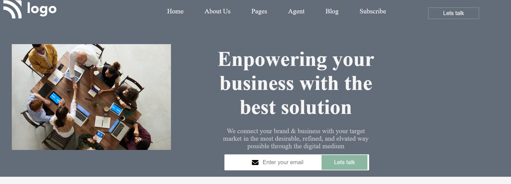

# Assigment 12

# **Project-12**
>- Skills gained in this project
 >- I learned about vh and vw, object-poisiton 
 >- I learned order property in flexbox
 
 ***
 **Time taken to finish to this project**
 
 >-It took me 4 hour to complete this project 

 **Screenshot**

 